**作者：** Waqar Khan， Muhammad Shahbaz Khan， Sultan Noman Qasem， Wad Ghaban， Faisal Saeed， Muhammad Hanif， Jawad Ahmad

## 摘要

阿茲海默症（ AD ）與額顳葉失智症（ FTD ）的早期準確診斷一直是醫學上的重大挑戰，尤其是傳統的機器學習（ Machine Learning ）模型往往無法提供預測的透明度，降低了使用者的信心與治療效果。為了克服這些限制，本文提出了一個可解釋且輕量化的深度學習框架，結合時序卷積網路（ Temporal Convolutional Network， TCN ）與長短期記憶網路（ Long Short-Term Memory， LSTM ），利用腦電圖（ EEG ）資料有效分類額顳葉失智症（ FTD ）、阿茲海默症（ AD ）與健康對照組。特徵工程（ Feature Engineering ）方面採用了改良的相對頻帶功率（ Relative Band Power， RBP ）分析，利用透過功率頻譜密度（ Power Spectral Density， PSD ）計算所萃取的六個 EEG 頻帶。模型在二元分類任務中達到 99.7% 的準確率，在多類別分類中達到 80.34% 的準確率。此外，為提升框架的透明度與可解釋性，整合了 SHAP（ SHapley Additive exPlanations ）作為可解釋人工智慧（ Explainable AI， XAI ）技術，提供對特徵貢獻的深入洞察。

**關鍵詞：** 可解釋人工智慧（ XAI ）、阿茲海默症（ Alzheimer's Disease ）、時序卷積網路（ TCN ）、長短期記憶網路（ LSTM ）、額顳葉失智症（ FTD ）、腦電圖（ EEG ）、精神疾病

---

## 1 引言

額顳葉失智症（ FTD ）與阿茲海默症（ AD ）是兩種最常見的失智症型態，主要影響 40 歲以上的族群。全球失智症盛行率預計將在 2050 年超過 1.3 億例。這些疾病病例的持續增加對全球醫療系統造成重大壓力，迫切需要準確且早期的診斷方法。目前 FTD 與 AD 的診斷仰賴神經心理評估、生物標記（ Biomarker ）分析、既定的臨床標準，以及磁振造影（ MRI ）等方法，但時間需求、需要專家判讀、進階神經影像工具的實用性限制，以及高昂的費用，都構成了重大障礙。因此，早期且準確的診斷至關重要，因為及早介入有助於延緩疾病進程並提升病患的生活品質。

腦電圖（ EEG ）具有高時間解析度、較低成本以及即時監測等特點，使其在失智症診斷中極具價值。結合機器學習（ Machine Learning ）的 EEG 訊號，具有成為有效非侵入性方法來偵測與監測 FTD 和 AD 的巨大潛力。然而，從 EEG 中萃取特徵是一項關鍵任務，儘管已有多種方法被提出，但許多方法在深度學習和機器學習模型上未能達到高準確率。因此，需要新穎且量身定做的方法來從 EEG 中萃取高品質資料，以改善基於深度學習的分析與診斷。

深度學習（ DL ）模型在 EEG 資料分類方面已展現出顯著的潛力，能提供更高的準確率與分析效率。然而，仍需要輕量化的模型來最佳化資料處理，並開發出具有高效能、省時且計算負擔較低的模型。此外，大多數 ML 與 DL 模型運作方式如同「黑箱（ Black Box ）」，在輸出結果時缺乏透明度，限制了它們的接受度，特別是在醫療照護等敏感領域。可解釋人工智慧（ XAI ）提供了一個解決方案，揭示模型在訓練過程中學到了什麼，以及在預測時如何做出決策，使結果更加易懂且可解釋。本研究的核心貢獻如下：

- 本研究提出了一種基於 EEG 的特徵萃取方法，使用改良的相對頻帶功率（ RBP ）分析進行特徵工程，並提出一個輕量化的混合深度學習分類器（ Hybrid Deep Learning Classifier ），用於準確且穩健地分類額顳葉失智症、阿茲海默症與健康對照。
- 整合 SHAP（ SHapley Additive exPlanations ）這一可解釋人工智慧技術，提供對特徵貢獻的更深入洞察，增加精神疾病診斷的可解釋性、透明度與預測可靠性。

---

## 2 相關研究

近年來的研究專注於以先進的機器學習方法強化阿茲海默症的偵測。研究 （ 14 ） 使用有向圖（ Directed Graph ）方法進行局部紋理特徵萃取，結合可調 q 因子小波轉換（ Tunable Q-factor Wavelet Transform ），模型在十折交叉驗證下達到 100%。研究 （ 15 ） 使用六種監督式機器學習方法來分類 FTD 和 AD 患者，隨機森林（ Random Forest ）模型達到 86.3% 的準確率。研究 （ 16 ） 提出 STEADYNet 卷積神經網路模型，在失智症偵測中達到 98.24% 的準確率。研究 （ 18 ） 提出「雙輸入卷積編碼器網路」，結合卷積層、轉換器架構與前饋模組，達到 83.28% 的準確率。

---

## 3 方法論

### 3.1 資料收集

資料集由 88 名受試者的 EEG 記錄組成（ 36 名阿茲海默症、29 名健康者、23 名額顳葉失智症 ），資料取自 AHEPA 綜合大學醫院第二神經科。EEG 訊號使用 19 個電極在受試者閉眼靜坐狀態下擷取，初始濾波範圍為 0.5 至 60 Hz，取樣頻率為 500 Hz。

### 3.2 資料前處理

為提升 EEG 訊號品質並移除不需要的偽跡（ Artifact ），採用了系統性的前處理流程。首先，使用頻率範圍 0.5 Hz 至 45 Hz 的巴特沃斯帶通濾波器（ Butterworth Bandpass Filter ）來保留相關的神經活動，同時消除低頻漂移與高頻雜訊。接著，實施偽跡子空間重建（ Artifact Subspace Reconstruction， ASR ）來辨識與修正訊號失真。ASR 透過測量 0.5 秒窗口內訊號片段的標準差來偵測偽跡，超過偏差閾值 17 的片段會被重建，以抑制暫態偽跡，同時保持神經活動的完整性。

偽跡修正後，使用 RunICA 演算法（ Algorithm ）執行獨立成分分析（ Independent Component Analysis， ICA ），將 19 通道的 EEG 訊號分解為獨立成分。隨後使用 EEGLAB 的 ICLabel 工具對獨立成分進行分析，自動根據來源特性對成分進行分類。被辨識為「眼動偽跡（ Eye Artifact ）」或「顎動偽跡（ Jaw Artifact ）」的成分會被移除，以確保處理後的訊號中僅保留神經活動。

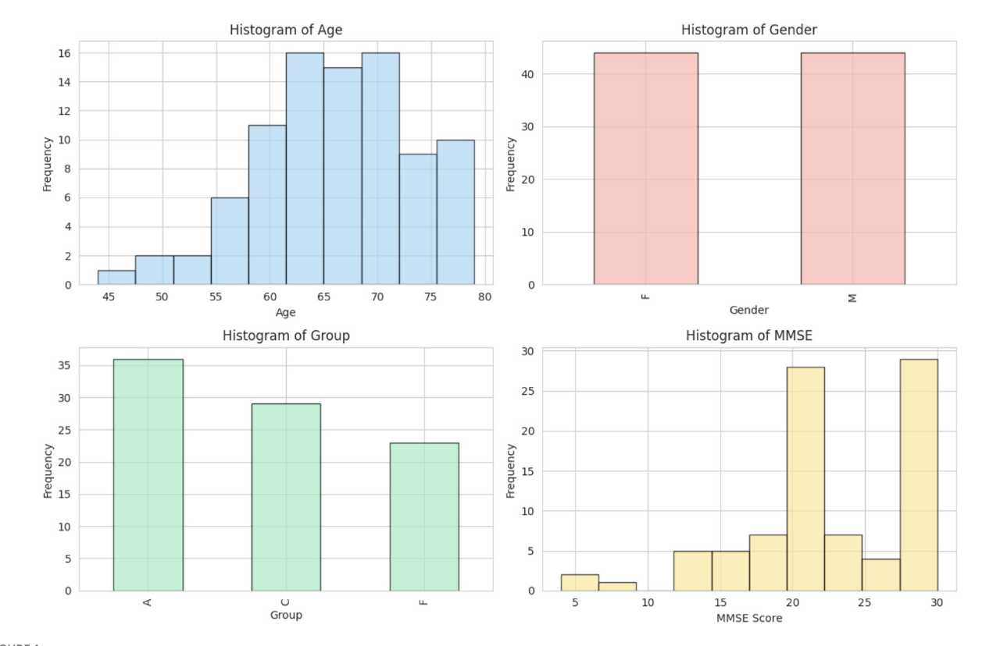

**圖 1** 資料集的統計概覽。

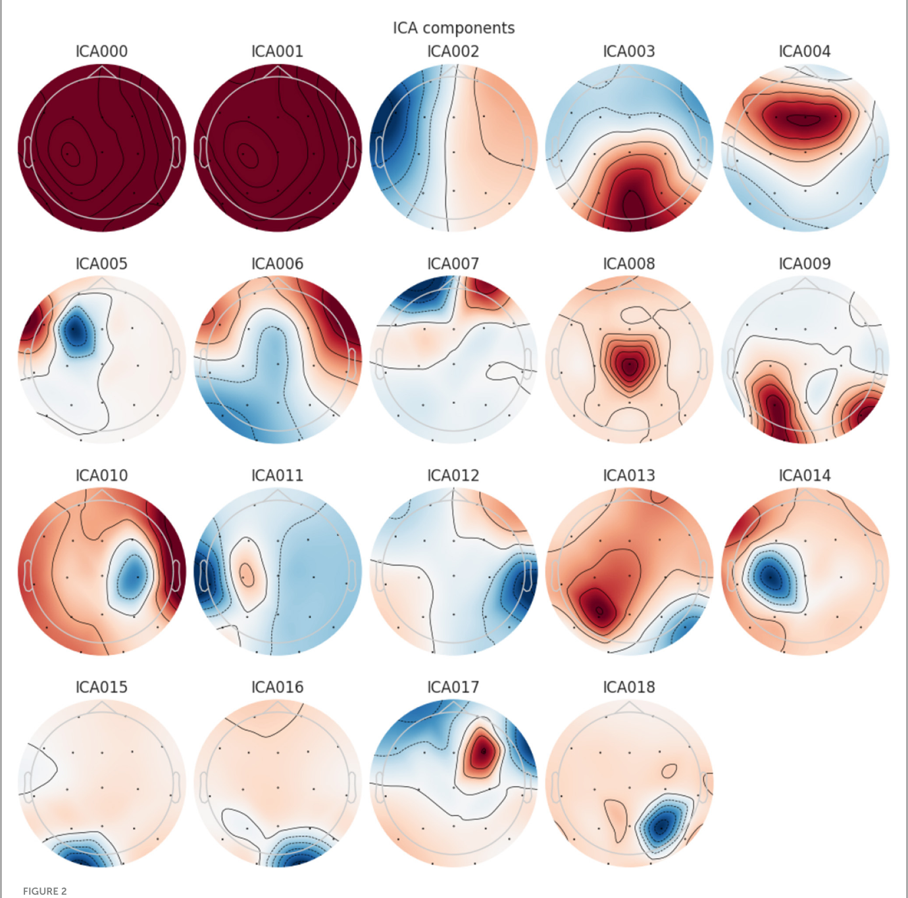

**圖 2** 從 EEG 訊號萃取的獨立成分分析（ ICA ）成分。

### 3.3 特徵工程（ Feature Engineering ）

在 EEG 分類任務中，通常會萃取相對頻帶功率（ RBP ），尤其是在分析與各種神經及認知狀態相關的腦部活動時。本研究考慮了六個感興趣的頻帶：

- **Delta：** $0.5 \leq f < 4 \text{ Hz}$
- **Theta：** $4 \leq f < 8 \text{ Hz}$
- **Alpha：** $8 \leq f < 16 \text{ Hz}$
- **Zaeta：** $16 \leq f < 24 \text{ Hz}$
- **Beta：** $24 \leq f < 30 \text{ Hz}$
- **Gamma：** $30 \leq f \leq 45 \text{ Hz}$

使用韋爾奇法（ Welch Method ）透過以下公式計算功率頻譜密度（ PSD ）：

$$\text{PSD}(f) = \lim_{N \to \infty} \frac{1}{N} \sum_{n=0}^{N-1} |X(f_n)|^2 \quad (1)$$

其中 $X(f_n)$ 是訊號 $x(t)$ 在頻率格點 $f_n$ 處的傅立葉轉換（ Fourier Transform ），$N$ 是對傅立葉轉換進行平均的片段總數。每個頻帶 $b$ 的 RBP 透過將該頻帶內的功率除以總功率來確定：

$$\text{RBP}_b = \frac{\sum_{f=\min}^{f_{\max}} \text{PSD}(f)}{\sum_{f=0.5}^{45} \text{PSD}(f)} \quad (3)$$

EEG 訊號被分割為每段 6 秒且具有 50% 重疊的時期（ Epoch ）。每個時期的 RBP 跨所有通道計算：

$$\text{Epoch RBP} = \frac{1}{N_{\text{channels}}} \sum_{i=1}^{N_{\text{channels}}} \text{RBP}_b(i) \quad (4)$$

每個時期的 RBP 值組成最終的特徵矩陣（ Feature Matrix ），各行對應六個頻帶（ Delta、Theta、Alpha、Zaeta、Beta、Gamma ）。

### 3.4 標籤編碼（ Label Encoding ）、資料正規化（ Normalization ）與分割

使用獨熱編碼（ One-Hot Encoding ）將類別變數轉換為數值資料，接著使用最小-最大正規化（ Min-Max Normalization ）：

$$\chi^* = \frac{\chi - \mu_{\min}}{\mu_{\max} - \mu_{\min}} \quad (5)$$

訓練集、驗證集（ Validation Set ）與測試集（ Test Set ）分別佔總資料集的 80%、10% 和 10%。

### 3.5 提出的深度學習模型

所提出的混合模型由兩個深度學習組件組成：LSTM 與 TCN。TCN 使用擴張因果卷積（ Dilated Causal Convolution ）從輸入序列中獲取高階特徵，而 LSTM 則捕捉序列相依性（ Sequential Dependency ）。

$$H^{(l)} = \sigma(W^{(l)} * X + b^{(l)}) \quad (6)$$

擴張卷積（ Dilated Convolution ）可用來捕捉 EEG 資料中的長程相依性：

$$H_t^{(l)} = \sum_{i=0}^{k-1} W_i^{(l)} \cdot X_{t-d \cdot i} + b^{(l)} \quad (7)$$

採用殘差連接（ Residual Connection ）以最佳化穩定性與梯度流動（ Gradient Flow ）：

$$H_{\text{res}}^{(l)} = H^{(l)} + X \quad (8)$$

LSTM 使用三個主要閘門（ 遺忘閘門（ Forget Gate ）、輸入閘門（ Input Gate ）和輸出閘門（ Output Gate ） ）來處理從 TCN 萃取的特徵：

$$f_t = \sigma(W_f H_t^{(l)} + U_f h_{t-1} + b_f) \quad (9)$$
$$i_t = \sigma(W_i H_t^{(l)} + U_i h_{t-1} + b_i) \quad (10)$$
$$c'_t = \tanh(W_c H_t^{(l)} + U_c h_{t-1} + b_c) \quad (11)$$
$$c_t = f_t \odot c_{t-1} + i_t \odot c'_t \quad (12)$$
$$o_t = \sigma(W_o H_t^{(l)} + U_o h_{t-1} + b_o) \quad (13)$$
$$h_t = o_t \odot \tanh(c_t) \quad (14)$$

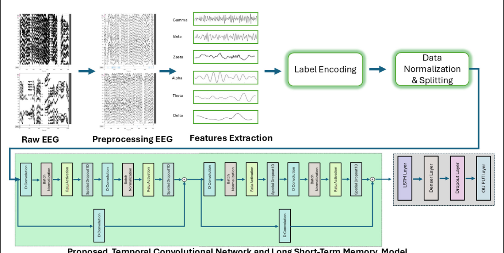

**圖 3** 所提出的方法論與深度學習模型。

**表 1** 模型架構摘要。

| 層別（ 類型 ） | 輸出形狀 | 參數量 | 連接至 |
| :--- | :--- | :--- | :--- |
| Input layer | （ None， 6， 1 ） | 0 | - |
| Conv 1D | （ None， 6， 32 ） | 256 | Input layer |
| Batch normalization | （ None， 6， 32 ） | 128 | Conv1D |
| Activation | （ None， 6， 32 ） | 0 | Batch normalization |
| Spatial dropout 1D | （ None， 6， 32 ） | 0 | Activation |
| Conv1D | （ None， 6， 32 ） | 7,200 | Spatial dropout 1D |
| Batch normalization | （ None， 6， 32 ） | 128 | Conv1D |
| Activation | （ None， 6， 32 ） | 0 | Batch normalization |
| Conv 1D （ residual ） | （ None， 6， 32 ） | 64 | Input layer |
| Add | （ None， 6， 32 ） | 0 | Conv1D + Spatial dropout |
| LSTM | （ None， 64 ） | 24,832 | Add |
| Dense | （ None， 128 ） | 8,320 | LSTM |
| Dense | （ None， 192 ） | 24,768 | Dropout |
| Dense | （ None， 256 ） | 49,408 | Dropout |
| Dense （ output ） | （ None， 3 ） | 771 | Dropout |

### 3.6 超參數調整（ Hyperparameter Tuning ）

使用隨機搜索（ Random Search ）找出最佳超參數：兩個 TCN 區塊、32 個濾波器、核心大小 7、丟棄率（ Dropout Rate ） 0.3、擴張率 1。LSTM 為單層 64 個單元。密集層設置為 128、192 和 256 個單元，丟棄率 0.2。批次大小（ Batch Size ）為 32，Adam 最佳化器（ Optimizer ）學習率（ Learning Rate ）為 0.0001。

**表 2** 模型參數摘要。

| 參數類型 | 數量 | 大小 |
| :--- | :--- | :--- |
| 總參數 | 131,587 | 514.01 KB |
| 可訓練參數 | 131,331 | 513.01 KB |
| 不可訓練參數 | 256 | 1 KB |

### 3.7 分類

所提出的混合 TCN-LSTM 模型執行四種分類任務：

- **三類別分類：** 健康對照、額顳葉失智症與阿茲海默症
- **AD + FTD vs. 健康**
- **AD vs. 健康**
- **FTD vs. 健康**

---

## 4 結果

### 4.2 效能評估

**表 3** 阿茲海默症、額顳葉失智症與健康類別的分類指標。

| 類別 | 精確率 | 召回率 | F1 分數 | 敏感度 | 特異度 | 支持數 |
| :--- | :--- | :--- | :--- | :--- | :--- | :--- |
| Alzheimer | 0.70 | 0.90 | 0.79 | 0.90 | 0.74 | 1,876 |
| Frontotemporal | 1.00 | 1.00 | 1.00 | 1.00 | 1.00 | 1,597 |
| Healthy | 0.68 | 0.35 | 0.47 | 0.35 | 0.95 | 1,106 |

**表 7** 不同失智症分類任務的分類準確率。

| 分類任務 | 準確率 |
| :--- | :--- |
| 額顳葉失智症 vs. 健康 | 0.9970 |
| 阿茲海默症 vs. 健康 | 0.9974 |
| 阿茲海默症 + 額顳葉失智症 vs. 健康 | 0.9980 |
| 阿茲海默症 vs. 額顳葉失智症 vs. 健康 | 0.8034 |

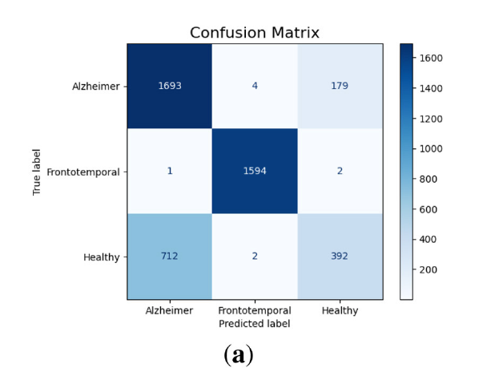
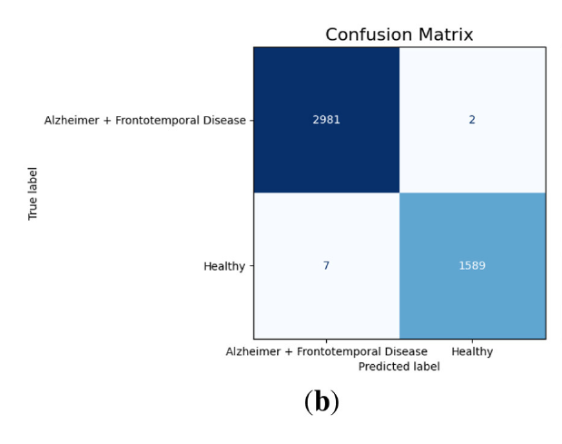
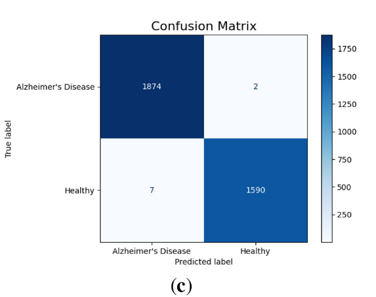
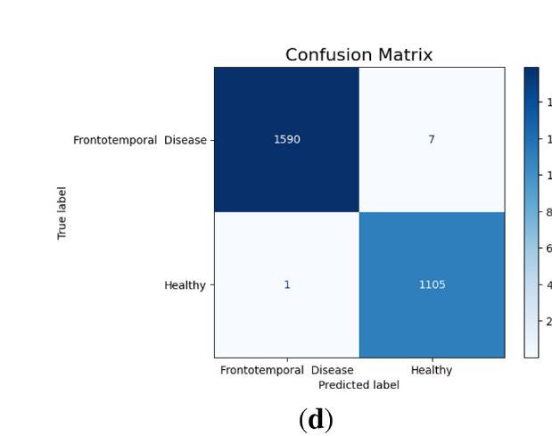

**圖 4** 不同分類情境的混淆矩陣。（ a ） AD vs. FTD vs. 健康。（ b ） AD + FTD vs. 健康。（ c ） AD vs. 健康。（ d ） FTD vs. 健康。

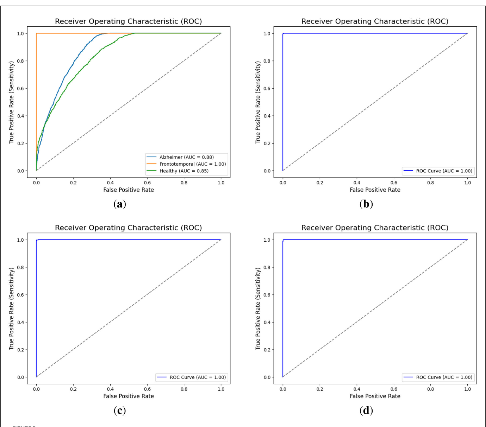

**圖 5** 不同分類情境的 AUC 曲線。（ a ） AD vs. FTD vs. 健康。（ b ） AD + FTD vs. 健康。（ c ） AD vs. 健康。（ d ） FTD vs. 健康。

### 4.3 使用 SMOTE 平衡的模型效能評估

使用 SMOTE（ Synthetic Minority Over-sampling Technique ）資料平衡技術後，平衡後模型的整體準確率為 77.45%，略低於原始不平衡資料集的 80.34%。額顳葉失智症類別在所有指標上仍達到完美分數（ 1.00 ）。

### 4.4 使用 K 折交叉驗證的模型準確率評估

採用 5 折交叉驗證方法驗證模型。多類別分類測試準確率穩定維持在 80% 附近，二元分類（ AD vs. 健康 ）測試準確率均超過 99.8%，證明模型具有穩健且可靠的區分能力。

### 4.5 特徵萃取方法的比較分析

標準 RBP 方法在多類別分類任務中僅達到 63.03% 的準確率，而改良 RBP 達到 80.34%。二元分類中，標準方法準確率為 76.36%，改良方法達到 99.71%。

### 4.6 與現有 ML 和 DL 模型的比較

**表 14** 使用相同資料集的模型準確率比較。

| 論文 | 模型 | 準確率 | XAI |
| :--- | :--- | :--- | :--- |
| Ma et al. | SVM | 91.5% | 否 |
| Miltiadous et al. | DICE-net | 83.28% | 否 |
| Kachare et al. | STEADYNet | 97.59% | 否 |
| Chen et al. | Vision Transformer + CNN | 80.23% | 否 |
| 本研究 | TCN-LSTM | 80.34%， 99.7% | 是 |

---

## 5 可解釋人工智慧（ Explainable AI ）

SHAP 全域特徵重要性（ Global Feature Importance ）分析顯示，Zaeta 和 Beta 頻帶在所有分類任務中持續展現高 SHAP 值，表示它們在區分 AD、FTD 和健康對照方面具有主導性的貢獻。

- **健康類別**
  Zaeta 具有最高的重要性（ +0.1 ），其次是 Beta（ +0.07 ）和 Theta（ +0.05 ）。

- **阿茲海默症**
  Beta 展現最高重要性（ +0.19 ），其次是 Zaeta（ +0.12 ）和 Theta（ +0.06 ）。

- **額顳葉失智症**
  Beta 具有最顯著的影響（ +0.26 ），Zaeta 為第二重要的特徵（ +0.2 ）。

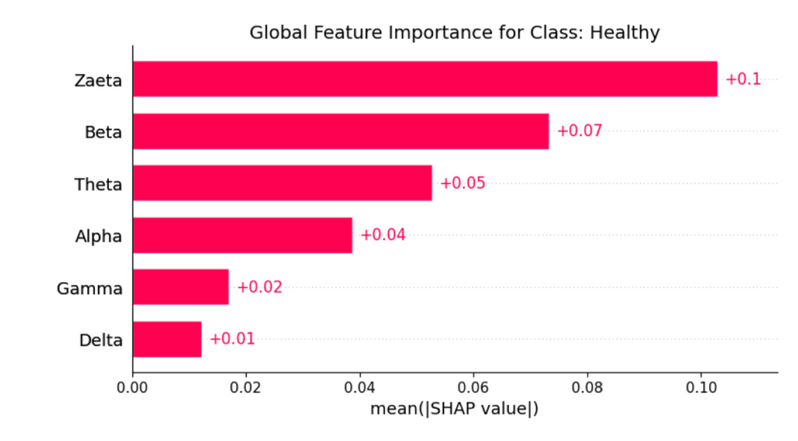

**圖 6** 健康類別的 SHAP 全域特徵重要性圖。

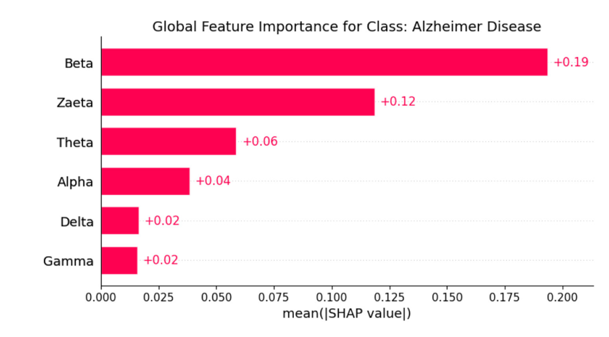

**圖 7** 阿茲海默症類別的 SHAP 全域特徵重要性圖。

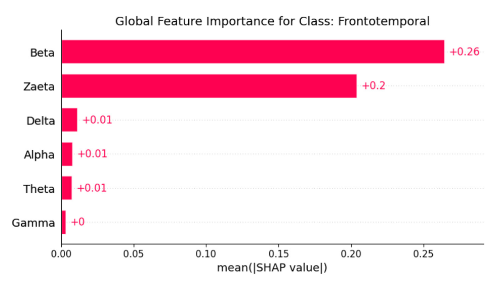

**圖 8** 額顳葉失智症類別的 SHAP 全域特徵重要性圖。

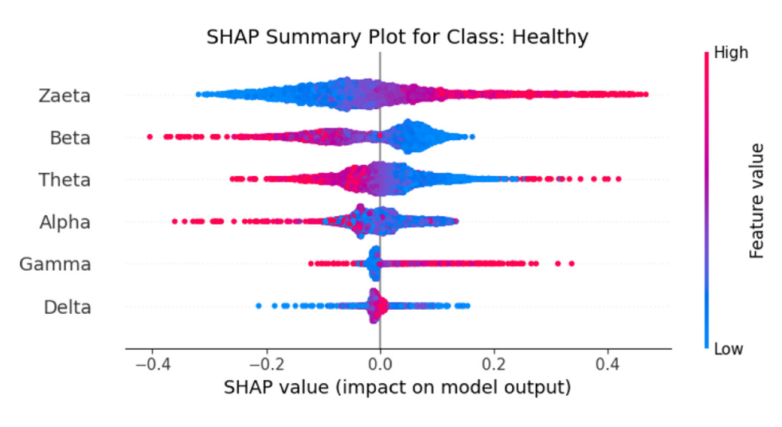

**圖 9** 健康類別的 SHAP 摘要圖。

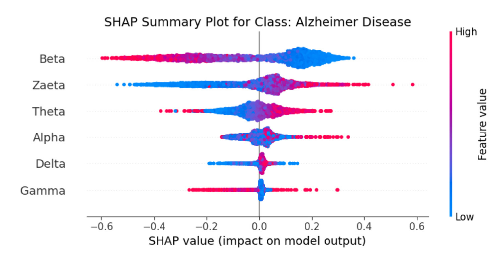

**圖 10** 阿茲海默症類別的 SHAP 摘要圖。

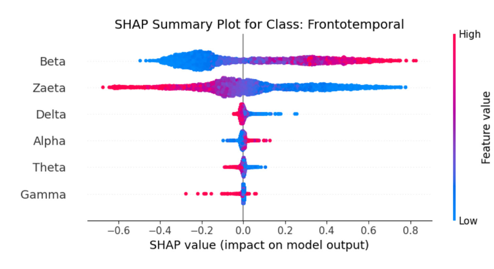

**圖 11** 額顳葉失智症類別的 SHAP 摘要圖。

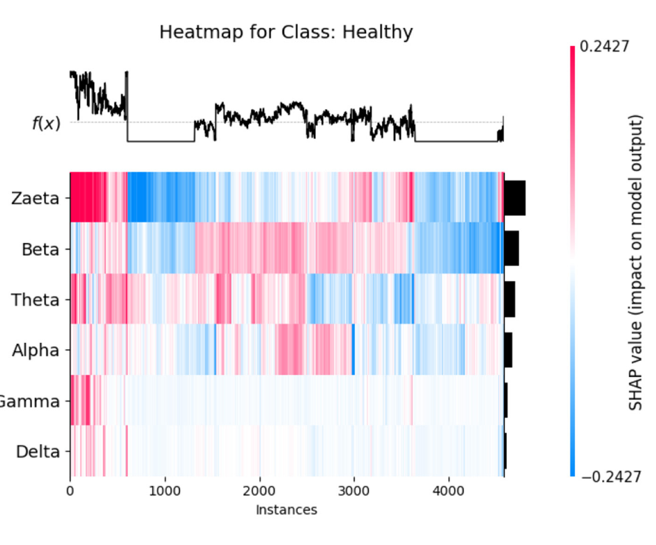

**圖 12** 健康類別的 SHAP 熱力圖。

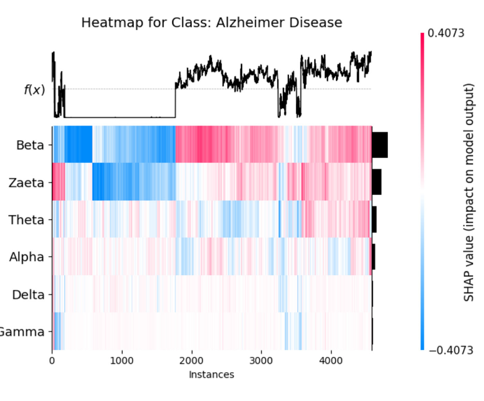

**圖 13** 阿茲海默症類別的 SHAP 熱力圖。

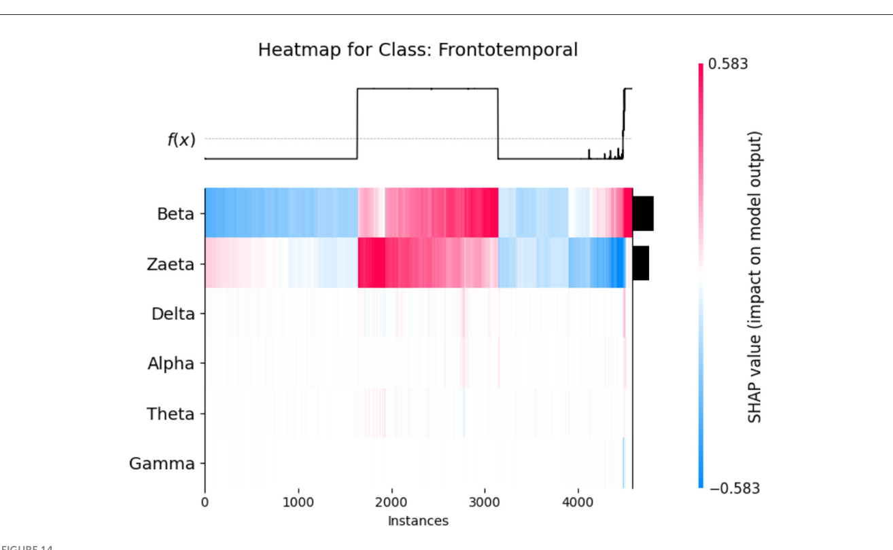

**圖 14** 額顳葉失智症類別的 SHAP 熱力圖。

### 5.1 頻帶重要性的神經生理學解讀

Beta 頻帶與主動認知處理（ Active Cognitive Processing ）、注意力（ Attention ）和運動控制（ Motor Control ）相關。AD 患者中已報告 Beta 活動的異常，通常與認知和執行功能（ Executive Function ）的中斷有關。

Zaeta 頻帶與高 Alpha 到低 Beta 的範圍重疊，作為過渡頻帶（ Transitional Band ）。本研究的改良 RBP 分析將 Zaeta 作為獨立頻帶捕捉，實現更精細的區分。Zaeta 在 SHAP 分析中的高重要性表明，中頻節律（ Mid-frequency Rhythm ）的微妙變化在疾病特異性 EEG 模式中扮演重要角色。

---

## 6 結論與未來方向

本文針對 AD 和 FTD 的準確且高效偵測，提出了一個輕量化的 TCN-LSTM 混合模型。透過改良的 RBP 分析萃取六個 EEG 頻帶，模型在二元分類中達到 99.7% 以上準確率，三類別分類達到 80.34%。SHAP 整合用於可解釋性，進一步增強了模型的透明度。模型僅有 131,587 個參數（ 514 KB ），適合部署在邊緣醫療裝置上。

未來研究可能包括使用更大且更多樣化的資料集，探索血管型失智症（ Vascular Dementia ）、路易體失智症（ Lewy Body Dementia ）和克雅二氏症（ Creutzfeldt-Jakob Disease ）等更多類型。

---

## 參考文獻

1. Bang J， et al. Frontotemporal dementia. *Lancet*. （ 2015 ） 386:1672-82.
2. Association A， et al. 2013 Alzheimer's disease facts and figures. *Alzheimers Dement*. （ 2013 ） 9:208-45.
3. Prince M， et al. World Alzheimer Report 2015. London: Alzheimer's Disease International.
8. Miltiadous A， et al. A dataset of scalp EEG recordings of Alzheimer's disease， frontotemporal dementia and healthy subjects. *Data*. （ 2023 ） 8:95.
14. Dogan S， et al. Primate brain pattern-based Alzheimer's disease detection model using EEG signals. *Cogn Neurodyn*. （ 2023 ） 17:647-59.
15. Miltiadous A， et al. Alzheimer's disease and frontotemporal dementia: a robust classification method of EEG signals. *Diagnostics*. （ 2021 ） 11:1437.
16. Kachare PH， et al. STEADYNet: spatiotemporal EEG analysis for dementia detection using CNN. *Cogn Neurodyn*. （ 2024 ） 18:1-14.
18. Miltiadous A， et al. DICE-net: a novel convolution-transformer architecture for Alzheimer detection in EEG signals. *IEEE Access*. （ 2023 ） 11:71840-58.
22. Lundberg SM， Lee S-I. A unified approach to interpreting model predictions. *NeurIPS*. （ 2017 ） p. 4768-77.
