# Paper reproduction briefing

這份報告用簡報方式說明：原始論文結果、我們照論文流程復刻出的結果，以及兩者如何比較。所有圖片都是 `.jpg`，放在 `asserts/`，不引用 SVG。

> Support 圖的讀法：正式復現仍以 80/10/10 為主；80/20 support-audit 是為了解釋論文 reported support 的數量疑點，所以 Table 3-6 support 圖會同時放三組柱狀。

> 說明原則：圖片只放圖表本體、座標軸、legend 與必要數值；解釋文字放在報告段落，不塞進圖片裡。

### 1. 一眼看完成狀態

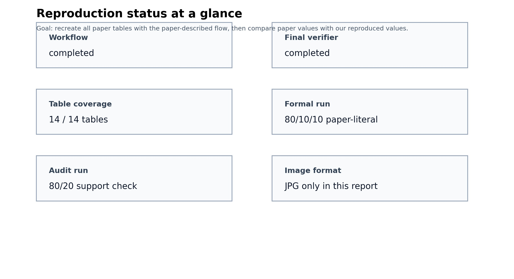

這張圖只回答一件事：完整 workflow、final verifier、Table 1-14 coverage 是否完成。

### 2. Table 1-14 覆蓋地圖

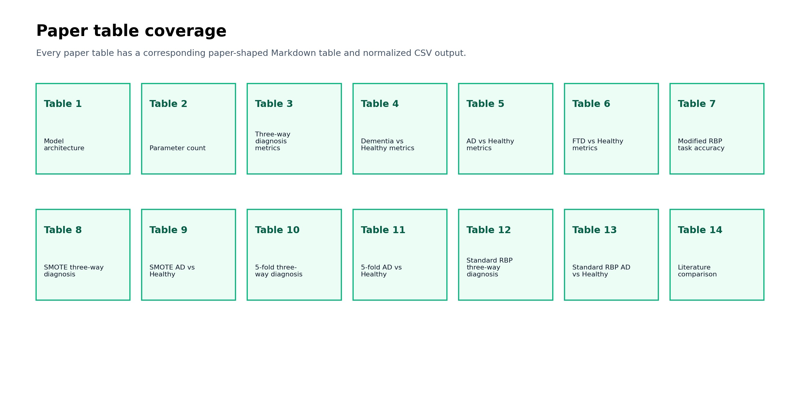

每一格代表原始論文一張 table。本專案已為每張 table 產生對應的 CSV 與 paper-shaped Markdown。

### 3. 正式復現 protocol

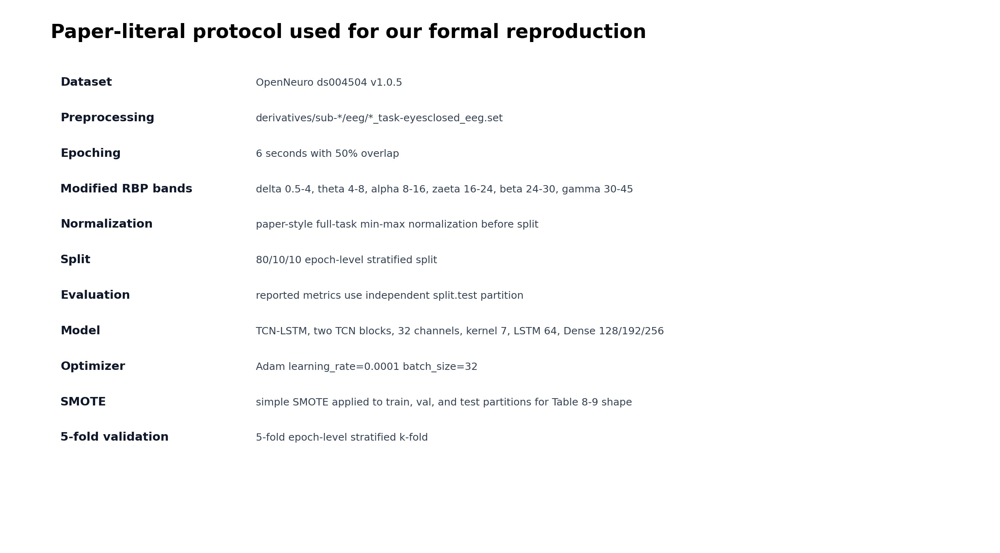

正式結果使用 paper-literal 80/10/10 流程。80/20 run 只用來檢查論文 support 數量疑點，不是正式主結果。

### 4. Modified RBP accuracy 對比

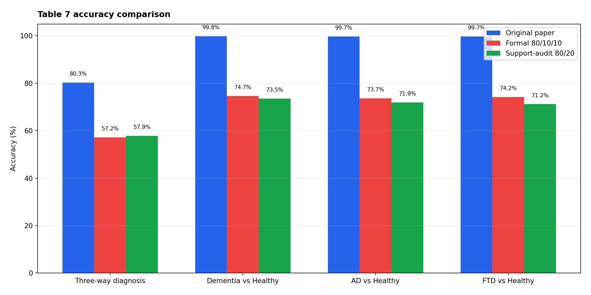

對應論文 Table 7。這張圖同時放原始論文、正式 80/10/10 復現、80/20 support-audit，避免只看 formal run 而看不出第二個 scenario 對 accuracy 的影響。

### 5. SMOTE accuracy 對比

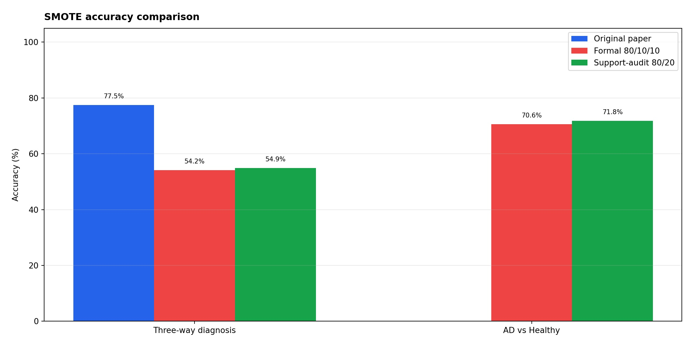

對應論文 Table 8-9。這張圖同時放原始論文、正式 80/10/10 復現、80/20 support-audit；因為論文未清楚交代 SMOTE placement，本專案把兩種 split interpretation 都攤開。

### 6. Standard RBP accuracy 對比

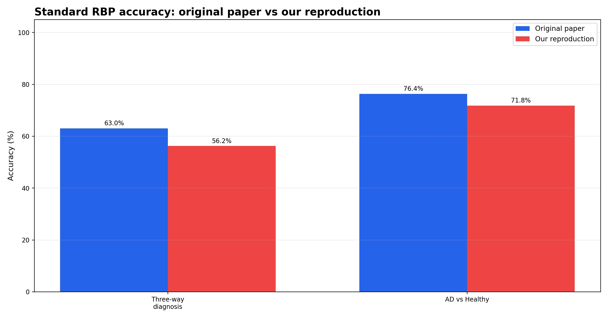

對應論文 Table 12-13，用 standard five-band RBP 做對照。

### 7. Table 3 support 對比

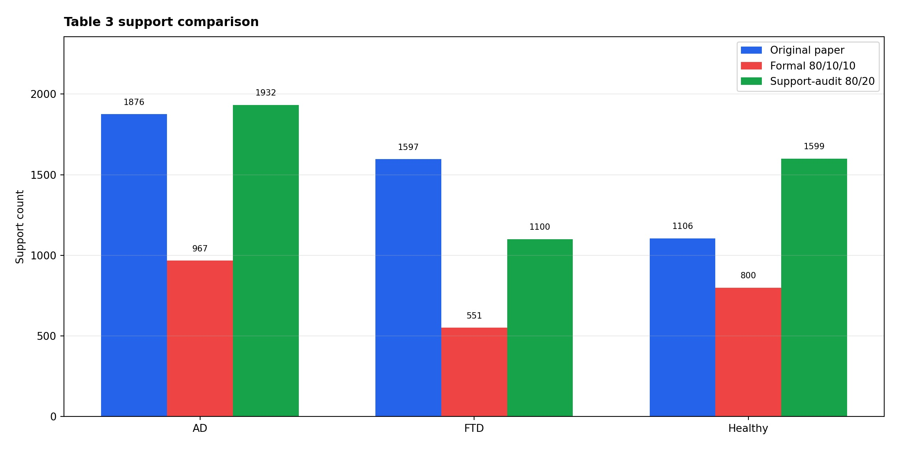

三分類任務的 support 數量。這張圖同時比較原始論文、正式 80/10/10 復現，以及 80/20 support-audit；可以直觀看出 reported support 比較接近 80/20，而不是論文文字宣稱的 10% test。

### 8. Table 4 support 對比

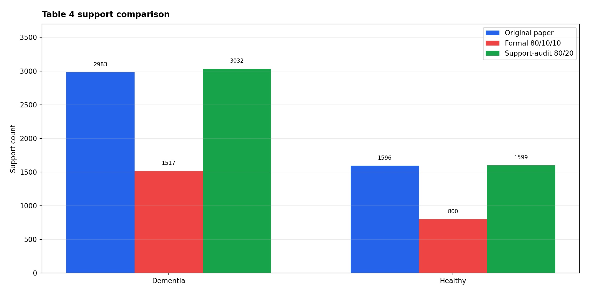

AD+FTD vs Healthy 任務的 support 對比，包含原始論文、正式 80/10/10、80/20 support-audit 三組。

### 9. Table 5 support 對比

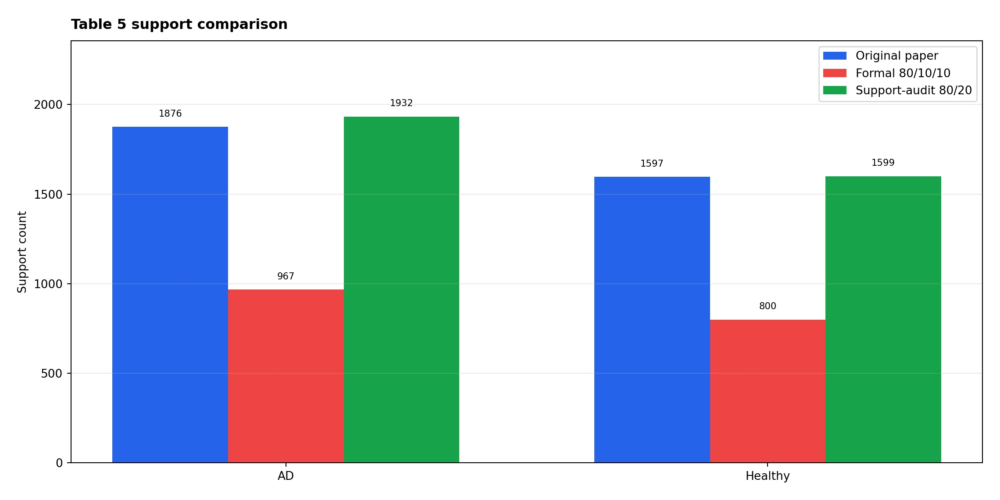

AD vs Healthy 任務的 support 對比，包含原始論文、正式 80/10/10、80/20 support-audit 三組。

### 10. Table 6 support 對比

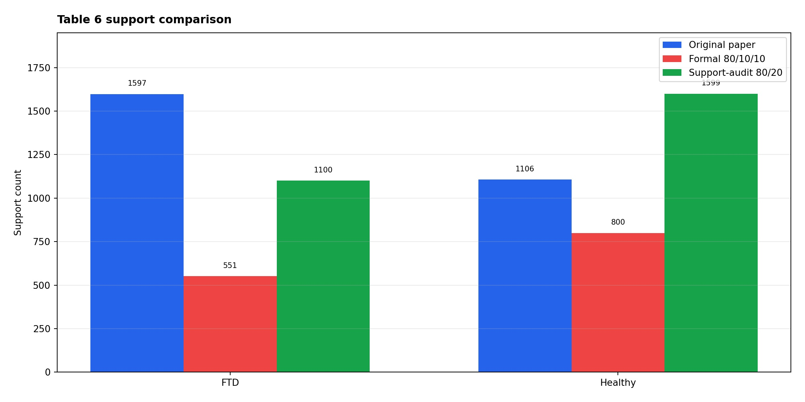

FTD vs Healthy 任務的 support 對比，包含原始論文、正式 80/10/10、80/20 support-audit 三組；這也是論文 FTD/Healthy support 疑點所在。

### 11. Table 3 confusion matrix

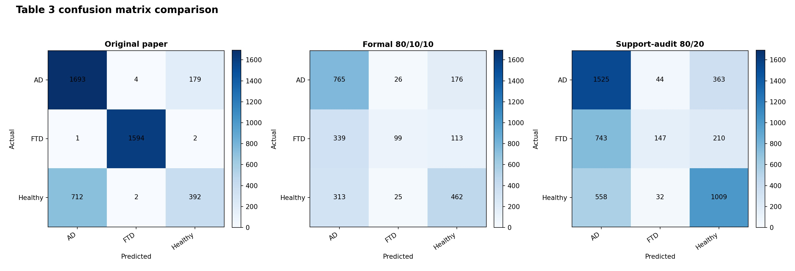

三欄分別是原始論文、正式 80/10/10 復現、80/20 support-audit。這樣可以同時看 support mismatch 和模型預測分布。

### 12. Table 4 confusion matrix

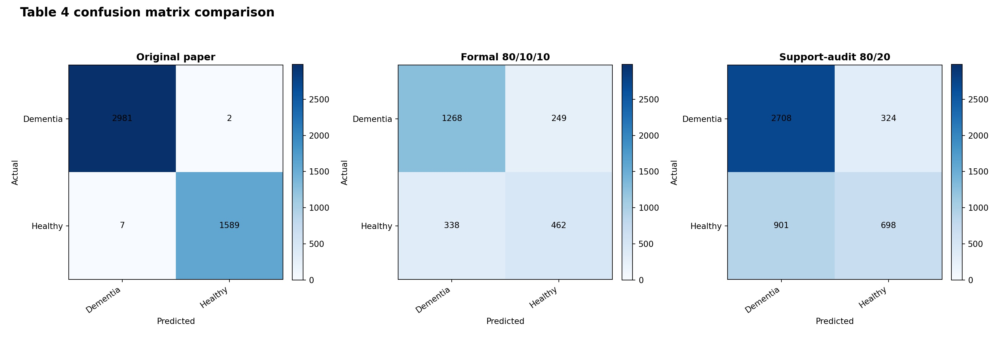

Dementia vs Healthy 的三方 confusion matrix：原始論文、正式 80/10/10、80/20 support-audit。

### 13. Table 5 confusion matrix

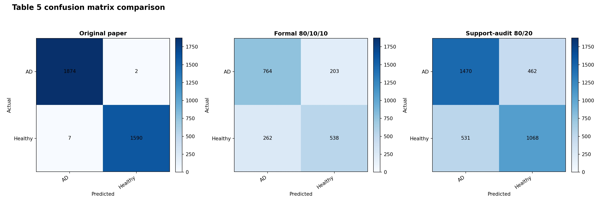

AD vs Healthy 的三方 confusion matrix：原始論文、正式 80/10/10、80/20 support-audit。

### 14. Table 6 confusion matrix

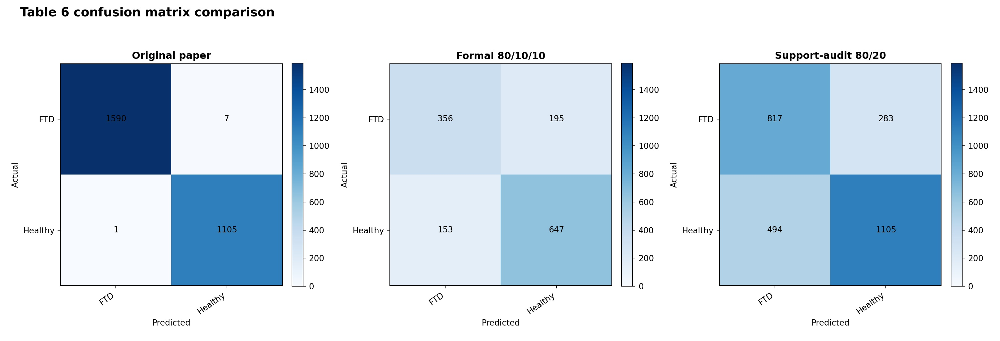

FTD vs Healthy 的三方 confusion matrix：原始論文、正式 80/10/10、80/20 support-audit。

### 15. Training history: three-way diagnosis

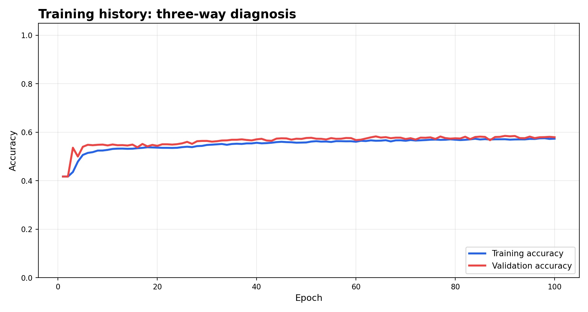

這是我們 formal 80/10/10 run 的 train/validation accuracy 曲線，用來看正式復現訓練是否收斂與是否過擬合；這不是 paper vs 80/20 比較圖。

### 16. Training history: dementia vs healthy

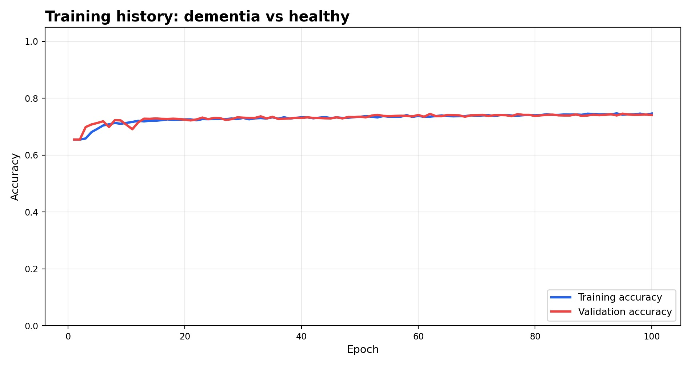

AD+FTD vs Healthy 任務的 formal 80/10/10 訓練曲線；這不是 paper vs 80/20 比較圖。

### 17. Training history: AD vs healthy

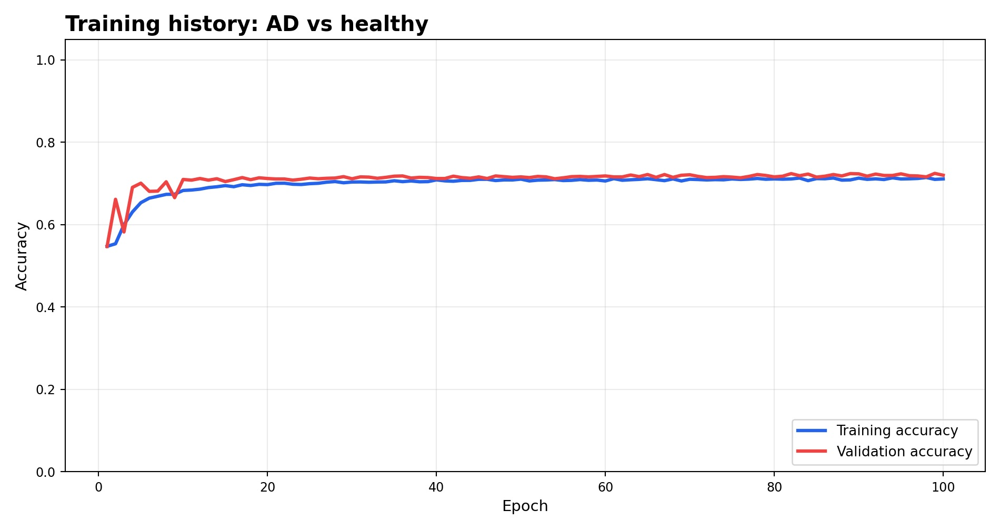

AD vs Healthy 任務的 formal 80/10/10 訓練曲線；這不是 paper vs 80/20 比較圖。

### 18. Training history: FTD vs healthy

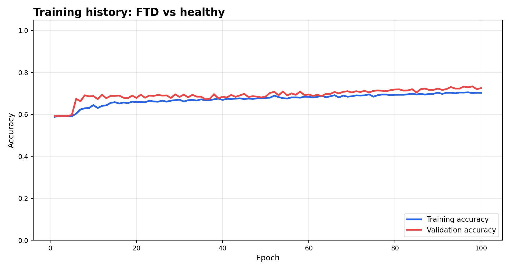

FTD vs Healthy 任務的 formal 80/10/10 訓練曲線；這不是 paper vs 80/20 比較圖。

### 19. ROC/AUC summary

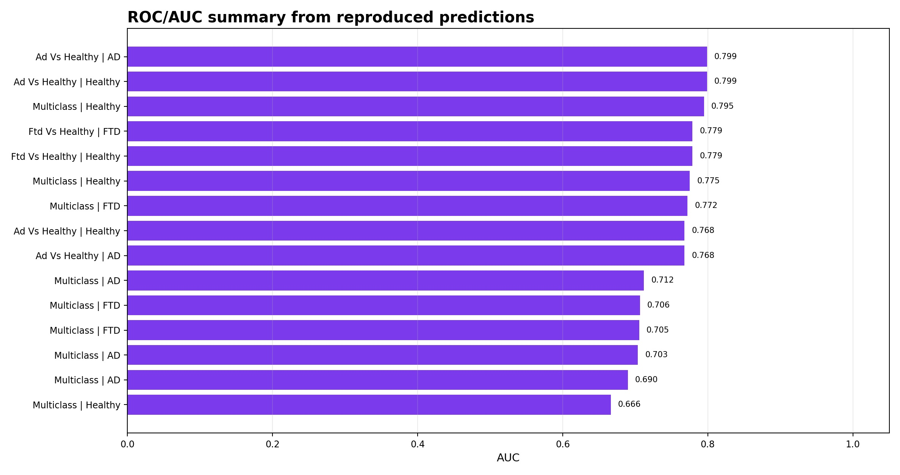

由我們復刻模型輸出的 prediction probabilities 計算 AUC；這是 ours-only validation diagnostic，論文沒有提供同等 ROC/AUC 曲線資料可直接三方比較。

### 20. 重要判讀注意事項

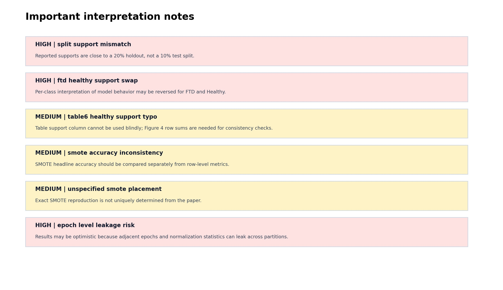

這些不是程式錯誤，而是論文敘述與表格之間會影響復現判讀的疑點。

### 21. 兩個 run 的角色

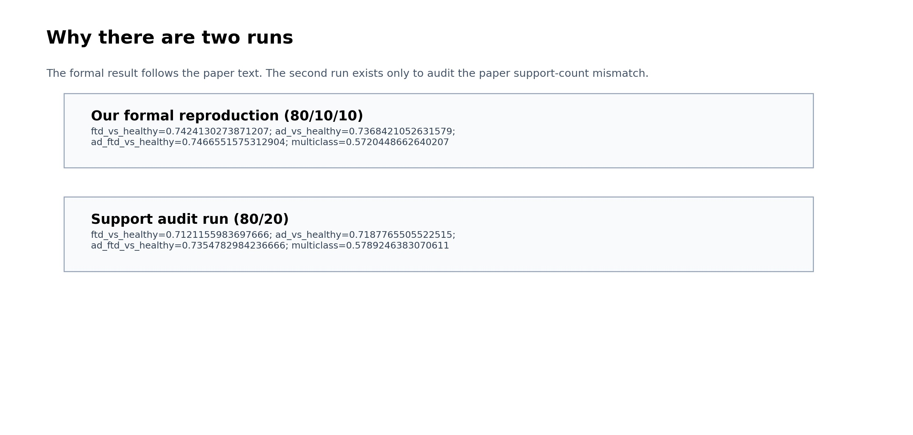

正式結論看 80/10/10 paper-literal run；80/20 run 只用來解釋 reported support 為什麼接近 20% holdout。

## Table 對應清單

| Paper table | Readable name | How to read it |
| --- | --- | --- |
| Table 1 | Model architecture | Architecture table; no accuracy/support metrics. |
| Table 2 | Parameter count | Parameter-count table; see model_parameters.csv for paper and ours counts. |
| Table 3 | Three-way diagnosis metrics | See paper_vs_ours.csv for per-metric differences. |
| Table 4 | Dementia vs Healthy metrics | See paper_vs_ours.csv for per-metric differences. |
| Table 5 | AD vs Healthy metrics | See paper_vs_ours.csv for per-metric differences. |
| Table 6 | FTD vs Healthy metrics | See paper_vs_ours.csv for per-metric differences. |
| Table 7 | Modified RBP task accuracy | See paper_vs_ours.csv for per-metric differences. |
| Table 8 | SMOTE three-way diagnosis | See paper_vs_ours.csv for per-metric differences. |
| Table 9 | SMOTE AD vs Healthy | See paper_vs_ours.csv for per-metric differences. |
| Table 10 | 5-fold three-way diagnosis | See paper_vs_ours.csv for per-metric differences. |
| Table 11 | 5-fold AD vs Healthy | See paper_vs_ours.csv for per-metric differences. |
| Table 12 | Standard RBP three-way diagnosis | See paper_vs_ours.csv for per-metric differences. |
| Table 13 | Standard RBP AD vs Healthy | See paper_vs_ours.csv for per-metric differences. |
| Table 14 | Literature comparison | Literature comparison table; no ours-side training output. |

## Accuracy 摘要表

| Paper table | Original paper accuracy | Our formal reproduction accuracy |
| --- | --- | --- |
| Table 7 | ftd_vs_healthy=0.997; ad_vs_healthy=0.9974; ad_ftd_vs_healthy=0.998; multiclass=0.8034 | ftd_vs_healthy=0.7424130273871207; ad_vs_healthy=0.7368421052631579; ad_ftd_vs_healthy=0.7466551575312904; multiclass=0.5720448662640207 |
| Table 8 | multiclass=77.45% | multiclass=0.5415374008962427 |
| Table 12 | multiclass=63.03% | multiclass=0.5621225194132873 |
| Table 13 | ad_vs_healthy=76.36% | ad_vs_healthy=0.7176004527447651 |

## Coverage gate 摘要

| Run | Artifact coverage | Status |
| --- | --- | --- |
| Our formal reproduction (80/10/10) | table_summary.csv:paper_table | ok |
| Our formal reproduction (80/10/10) | paper_vs_ours.csv:paper_table | ok |
| Our formal reproduction (80/10/10) | protocol_manifest.csv:component | ok |
| Our formal reproduction (80/10/10) | issue_summary.csv:issue_id | ok |
| Support audit run (80/20) | table_summary.csv:paper_table | ok |
| Support audit run (80/20) | paper_vs_ours.csv:paper_table | ok |
| Support audit run (80/20) | protocol_manifest.csv:component | ok |
| Support audit run (80/20) | issue_summary.csv:issue_id | ok |

## 名稱對照附錄

報告主文避免直接使用 raw profile / scenario 名稱；以下是對照表。

| Readable name in report | Raw artifact/profile name |
| --- | --- |
| Our formal reproduction (80/10/10) | paper_literal_80_10_10 |
| Support audit run (80/20) | val_as_test_80_20 |
| Three-way diagnosis | multiclass |
| Dementia vs Healthy | ad_ftd_vs_healthy |
| AD vs Healthy | ad_vs_healthy |
| FTD vs Healthy | ftd_vs_healthy |
| Modified RBP | modified_rbp |
| SMOTE + modified RBP | smote_modified_rbp |
| Standard RBP | standard_rbp |

## 主要 artifacts

- Normalized tables: `data/reports/ds004504_rbp_paper/paper_literal_80_10_10/tables/`
- Paper-shaped tables: `data/reports/ds004504_rbp_paper/paper_literal_80_10_10/paper_tables/`
- Scenario comparison: `data/reports/ds004504_rbp_paper/scenario_comparison/`
- This briefing: `docs/paper_reproduction_comparison/report.md`
- JPG images: `docs/paper_reproduction_comparison/asserts/`
