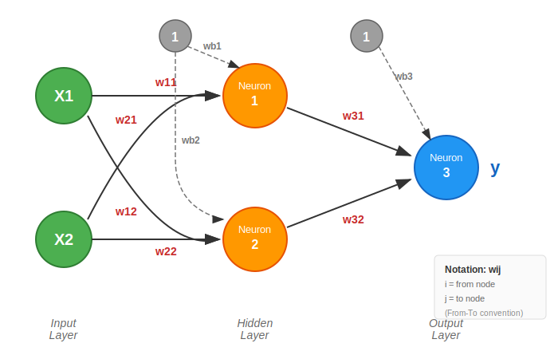

# Soft Computing Homework #02

**Deadline**: 2026/01/08 23:59, Online Submission

---

## 目標

以粒子群演算法 (PSO) 找出類神經網路 (ANN) 結構中的最佳化權重組合，解決 2 輸入的 XOR 問題。

---

## 1. XOR 問題

XOR 真值表：

| Input |     | Output |
|:-----:|:---:|:------:|
| X1    | X2  | Y      |
| 0     | 0   | 0      |
| 0     | 1   | 1      |
| 1     | 0   | 1      |
| 1     | 1   | 0      |

類神經網路需要使用隱藏層產生兩個不同的決策平面，根據輸出模式線性分離輸入資料。

---

## 2. 類神經網路架構

**2-2-1 結構**：
- 輸入層：2 個節點 (X1, X2)
- 隱藏層：2 個節點（需要兩個決策平面）
- 輸出層：1 個節點 (Y)

### 神經元特性

1. 神經元的輸入值為前一層神經元輸出的加權和 Σwᵢxᵢ
2. 激勵函數為 sigmoid 函數，輸出值介於 0 和 1 之間
3. 神經元輸出：

$$
y = \frac{1}{1 + e^{-(\sum w_i x_i + b)}}
$$

---

## 3. 損失函數

$$
\text{Loss} = \frac{1}{2} (y_{\text{desired}} - y)^2
$$

---

## 4. 繳交項目

**繳交格式**：程式碼 + 報告，壓縮成單一 ZIP 檔上傳 E-Course

### 報告內容

1. 程式所使用的程式語言、編譯器/直譯器版本、使用的函式庫與版本資訊
2. PSO 所有參數設定（Particle 編碼方式、粒子數量、速度計算公式和所需參數值、終止條件等）
3. PSO 所得最佳權重參數值
4. 搜尋過程結果：每一次 Search 的最佳結果以 2D 曲線圖記錄（縱軸為 Loss，橫軸為搜尋代數索引值）
5. 測試下列三組輸入值的結果：(0.7, 0.3), (0.6, 0.4), (0.5, 0.5)
6. **[Optional]** 使用 Gradient-Descent 訓練神經網路，並與 PSO 的結果進行比較
